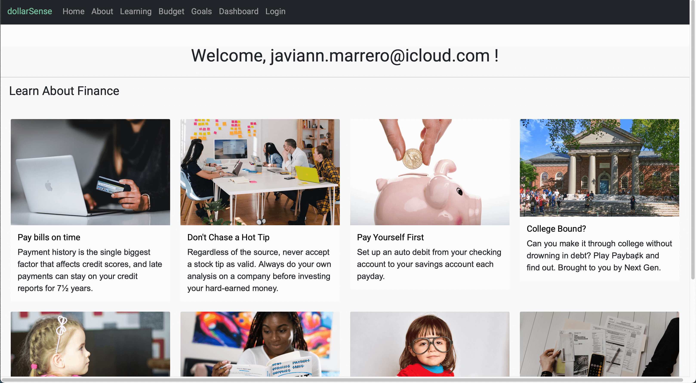

[](#license)


# dollarSense

An app built on React to help young people learn financial literacy and budgeting.

## Created by

- [Natalie Finnegan](https://github.com/nfinnegan)
- [Charles Fisher](https://github.com/cdfishe1)
- [Javiann Marrero](https://github.com/javiistacks)

## Table of Contents

- [User Story](#user-story)
- [dollarSense Demos](#dollarSense)
- [Deployment](#deployment)
- [Installation](#installation)
- [Challenges and Successes](#challenges-and-successes)
- [Directions for Future Development](#directions-for-future-development)
- [Credits](#credits)
- [Special Thanks](#special-thanks)
- [License](#license)

## User Story

```
As a user
I want to be able to learn how to save money and invest money.
So that, I can get familiar with real world responsibilities I will have as an adult.

```

## Acceptance Criteria

```
GIVEN a financial education website
When I go to the application, I’m brought to the homepage and there will be an informational introduction of what our website is about.
Then when I hit login I am prompted to enter my credentials, or if I select sign up I am presented with a signup form.
Then once either is complete a user will be shows a “success” message
Then when I am logged in or have successfully sign up, I am brought to my personal dashboard that shows me an overview of my achievements
That dashboard will have 3 tabs or views for goal setting, budgeting, and investing.

```

## dollarSense Demos

| ***Homepage***                                        | ***About Page***                                      |
| :--------------------------------:                    | :-----------------------------------:                 |
|        |       |

| ***Learing Page***                                    | ***Budget Page***                                     |
| :--------------------------------:                    | :-----------------------------------:                 |
|    |      | 

| ***Goals Page***                                      | ***Dashboard Page***                                  |
| :--------------------------------:                    | :-----------------------------------:                 |
|       |   | 


### Screencast on wide screen

### Screencast on mobile


## Deployment

Site deployed at [dollarSense](https://dollar-sense.herokuapp.com/)

## Installation

This app uses the following dependencies:

- [bootstrap](https://www.npmjs.com/package/bcrypt)
- [chart.js](https://www.npmjs.com/package/chart.js)
- [dotenv](https://www.npmjs.com/package/dotenv)
- [emoji-picker-react](https://www.npmjs.com/package/emoji-picker-react)
- [express](https://www.npmjs.com/package/express)
- [firebase](https://www.npmjs.com/package/firebase)
- [if-env](https://www.npmjs.com/package/if-env)
- [mdb-react-ui-kit](https://www.npmjs.com/package/mdb-react-ui-kit)
- [moment](https://www.npmjs.com/package/moment)
- [mongoose](https://www.npmjs.com/package/mongoose)
- [react](https://www.npmjs.com/package/react)
- [react-chartjs-2](https://www.npmjs.com/package/react-chartjs-2)
- [react-dom](https://www.npmjs.com/package/react-dom)
- [react icons](https://www.npmjs.com/package/react-icons)
- [react-moment](https://www.npmjs.com/package/react-moment)
- [react-router-dom](https://www.npmjs.com/package/react-router-dom)
- [react-script-tag](https://www.npmjs.com/package/react-script-tag)
- [react-scripts](https://www.npmjs.com/package/react-scripts)

### Installation Instructions

- In order to install this app please run npm install on the command line in node.js.
- You can use the .env.EXAMPLE file to input your specific information for the working .env file.
- If deploying to Heroku you will need to hook your MongoDB cluster to the webserver via Mongo Atlas.

## Challenges and Successes

- Having components use external javascripts was a challenge. We used React Script Tag to overcome this.
- Integrating Bootstrap into the React archiecture was sometimes challenging.
- Working with the Date object in JS was challenging. When a user saved a date, it saved to the DB in Greenwich Mean Time (GMT), and it was difficult to format the dates to display how we wanted. After getting 50% through the issues, MomentJS was implemented to come to a quicker solution.
- Responsiveness of images within Bootstrap cards were challenging at almost all levels of responsiveness. Ultimately left images for desktop/iPad views, but eliminated them on smaller views. 
- There were issues with using the .env file to hide our API key. We used the file to hide a handful of other personal keys as it relates to our Firebase Auth implementation, but for some reason the API key could not be read. It had to be inserted directly into the file for the connection to Firebase to work.
- Once a user signs up, there is a specific UID that Firebase assigns to the user. It was challenging to work through how to access the UID in the routes file in order to display the user specific budget/goals. Instead of doing it in the routes file, we ended up making our API calls within the component that alleviated the issue as well as passing that UID as a query parameter helped us achieve our goal.
- Getting chart.js to was challenging. We needed to use react-chartjs-2 in order to wrap the components in a react friendly way.
- We are proud to have built this entire site on React.

## Directions for Future Development

- Have different levels of support and resources based on age.
- Have an investing tutorial and calculator for young, working adults.
- Integrate existing financial services into calculations, such as bank accounts, investment accounts, etc.

## Special Thanks

- Irwin Marcano, bootcamp TA, helped us diagnose external javascript issues in React.

## License

Copyright (c) Natalie Finnegan, Charles Fisher, Javiann Marrero. All rights reserved.<br>
Please be kind and change content if you wish to use this code.

<details><summary>Licensed under the MIT License</summary>

Copyright (c) 2021 - present | Charles Fisher, Natalie Finnegan, Diego Villarreal

<blockquote>
Permission is hereby granted, free of charge, to any person obtaining a copy
of this software and associated documentation files (the "Software"), to deal
in the Software without restriction, including without limitation the rights
to use, copy, modify, merge, publish, distribute, sublicense, and/or sell
copies of the Software, and to permit persons to whom the Software is
furnished to do so, subject to the following conditions:

The above copyright notice and this permission notice shall be included in all
copies or substantial portions of the Software.

THE SOFTWARE IS PROVIDED "AS IS", WITHOUT WARRANTY OF ANY KIND, EXPRESS OR
IMPLIED, INCLUDING BUT NOT LIMITED TO THE WARRANTIES OF MERCHANTABILITY,
FITNESS FOR A PARTICULAR PURPOSE AND NONINFRINGEMENT. IN NO EVENT SHALL THE
AUTHORS OR COPYRIGHT HOLDERS BE LIABLE FOR ANY CLAIM, DAMAGES OR OTHER
LIABILITY, WHETHER IN AN ACTION OF CONTRACT, TORT OR OTHERWISE, ARISING FROM,
OUT OF OR IN CONNECTION WITH THE SOFTWARE OR THE USE OR OTHER DEALINGS IN THE
SOFTWARE.

</blockquote>
</details>
